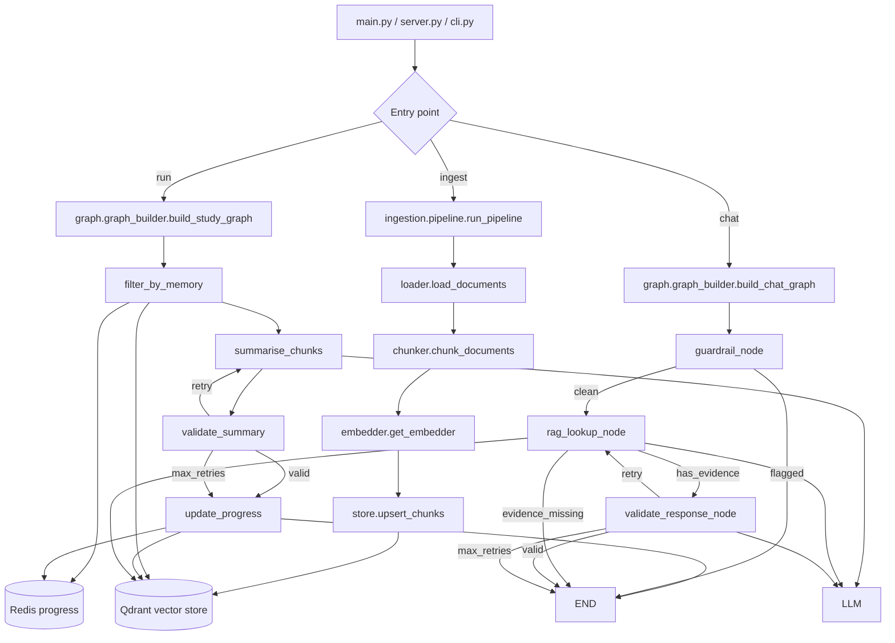

# High-Level Design

## Overview

This project is a LangGraph-based financial study system built around two primary flows and three entry points:

1. **Ingestion flow**: PDFs are loaded, chunked, embedded, and stored in Qdrant.
2. **Study graph**: reads active module/chapter from Redis, fetches matching chunks from Qdrant, generates + validates an LLM summary, and advances progress.
3. **Chat graph**: guardrails user input, retrieves seen-only content from Qdrant, generates + validates an LLM answer (with retries for better retrieval).

The current runtime is centered on `main.py`, `graph/graph_builder.py`, `graph/study_nodes.py`, `graph/chat_nodes.py`, `ingestion/`, `memory/`, and `quiz/quiz_service.py`.

## System Goals

- Turn local study PDFs into a searchable vector knowledge base.
- Track reading progress across runs without losing position.
- Generate and validate chapter-level summaries with an LLM.
- Answer user questions via RAG over already-studied content.
- Generate and grade MCQs from completed chapters.
- Persist progress, conversation memory, and per-chunk `seen` metadata.

## Runtime Entry Points

### CLI entry point (`main.py`)

Three subcommands:
- `ingest` — runs the PDF ingestion pipeline.
- `run` — starts the LangGraph study workflow.
- `chat` — runs the chat workflow with a one-off query.

### CLI chatbot (`python -m frontend.cli`)

Interactive REPL loop running the chat graph with memory persistence.

### Web server (`python -m frontend.server`)

FastAPI server with endpoints:
- `POST /api/chat` — chat via the chatbot graph.
- `POST /api/quiz/generate` — generate MCQs from seen chapters.
- `POST /api/quiz/submit` — grade a submitted quiz.
- `POST /api/teach/start` — reset progress to 1/1 and run study graph.
- `POST /api/teach/next` — run study graph from current position.

## High-Level Architecture

## Ingestion Flow

The ingestion pipeline runs as a fixed sequence in `ingestion/pipeline.py`:

1. **Load** PDFs from disk with `ingestion/loader.py` — one Document per page, with metadata (module_no, chapter_no, chapter_title, source_path, article_link).
2. **Chunk** with `ingestion/chunker.py` — strip preamble before chapter heading, truncate at the `Comments` section, split with `RecursiveCharacterTextSplitter`.
3. **Write** a markdown version per PDF to `data/md/` for inspection.
4. **Embed** via `ingestion/embedder.py` (sentence-transformers/all-MiniLM-L12-v2, 384d, L2-normalized).
5. **Upsert** into Qdrant via `ingestion/store.py` with full metadata payload including `seen: False`.

## Graph State

The shared graph state is defined in `graph/state.py` as `StudyState` (a `TypedDict`):

### Study fields
- `current_module`, `current_chapter` — current reading position (from Redis).
- `chunks`, `point_ids` — all Qdrant documents and their IDs for the current chapter.
- `total_chars` — total character count across chunks.
- `summary` — LLM-generated chapter summary.
- `summary_retry_count`, `summary_validation_passed` — validation loop counters.

### Chat fields
- `user_input` — the user's question.
- `messages` — LangChain message objects (conversation history).
- `guardrail_flagged`, `chatbot_response` — guardrail output.
- `rag_search_query`, `rag_retry_count`, `validation_passed`, `evidence_found` — RAG + validation loop.
- `memory_context` — formatted conversation history from `MemoryService`.

## Study Graph

Assembled in `graph/graph_builder.py:build_study_graph()`.

### Node 1: filter_by_memory (`graph/study_nodes.py`)
- Check Redis for existing progress keys; initialise to 1/1 if missing.
- Read current module and chapter from Redis.
- Fetch all chunks for that module/chapter from Qdrant via scroll.
- Compute total character count from chunk metadata.
- Initialise retry counters.

### Node 2: summarise_chunks (`graph/study_nodes.py`)
- Join chunks into a single text block.
- Call the configured LLM with a detailed system prompt targeting 50-80% of original length.
- Store the result in `state["summary"]`.

### Node 3: validate_summary_node (`graph/study_nodes.py`)
- LLM-based quality check: is the summary descriptive and in-depth?
- Length check: between 50% and 75% of original character count.
- Route: pass → `update_progress`, fail with retries → `summarise_chunks`, max retries → `update_progress`.

### Node 4: update_progress (`graph/study_nodes.py`)
- Mark all processed chunks as `seen = True` in Qdrant.
- Check if the next chapter exists; advance chapter or module accordingly.
- Persist new position to Redis.

## Chat Graph

Assembled in `graph/graph_builder.py:build_chat_graph()`.

### Node 1: guardrail_node (`graph/chat_nodes.py`)
- Check user input for abusive words, sexual content, and prompt injection patterns.
- Sets `guardrail_flagged` — edge routes to END if flagged.

### Node 2: rag_lookup_node (`graph/chat_nodes.py`)
- Classify query as financial or not (LLM-based).
- Search Qdrant for chunks with `seen == True`.
- Hard evidence gate: LLM checks if context directly answers the question.
- If passed, generate answer with LLM, append source citations, persist to message history.

### Node 3: validate_response_node (`graph/chat_nodes.py`)
- LLM-based quality check on the answer.
- On failure with retries remaining, generate an improved search query and route back to `rag_lookup_node`.
- On max retries, append a disclaimer note.

## Quiz Service (`quiz/quiz_service.py`)

Generates and grades multiple-choice questions from completed (seen) chapters.

- **Chapter selection**: weighted algorithm (40% topic-matched from user chat history, 30% recent chapters, 30% random).
- **Generation**: parallel LLM calls per chapter, batched in groups of 2.
- **Caching**: full quiz (with answers) cached in Redis for 1 hour.
- **Grading**: looks up cached quiz — no Qdrant or LLM needed at submission time.

## Persistent Memory

### Redis progress (`memory/progress.py`)
- Keys: `study:current_module_no`, `study:current_chapter_no`.
- No TTL — permanent tracking of reading position.

### Redis chat memory (`memory/chat_memory.py`)
- Key: `chat:memory` (TTL: 30 days).
- Stores JSON-serialised {timestamp, question, answer} entries.
- Automatic summarisation of old entries when list exceeds 15 messages.

## Configuration

Application settings in `config/settings.py` (Pydantic `BaseSettings`), loaded from `.env`:

- LLM model strings and temperature.
- Qdrant URL, collection name, RAG top-k.
- Redis URL.
- Embedding model name.
- Chunk size and overlap.
- LangSmith project and API key (wired via `setup_langsmith()`).

## Observability

LangSmith tracing is configured at all entry points via `setup_langsmith()` which sets the `LANGSMITH_TRACING`, `LANGSMITH_API_KEY`, and `LANGSMITH_PROJECT` environment variables from application settings.
