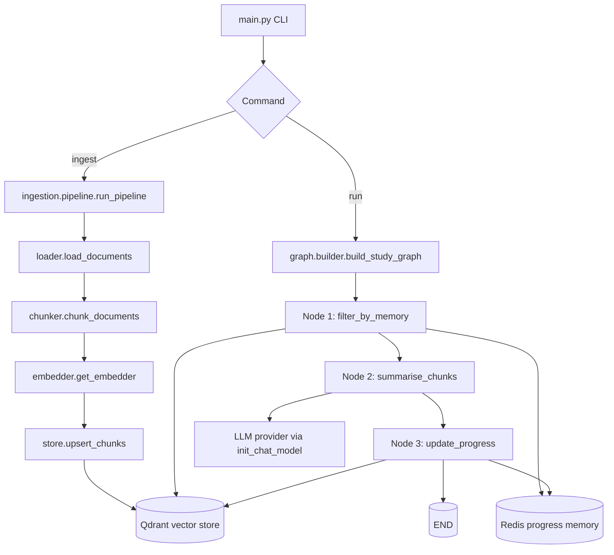

# High-Level Design

## Overview

This project is a LangGraph-based financial study system built around two primary flows:

1. Ingestion flow: PDFs are loaded, chunked, embedded, and stored in Qdrant.
2. Study flow: the active module/chapter is read from Redis, matching chunks are fetched from Qdrant, a summary is generated by an LLM, and progress is advanced.

The current live runtime is centered on [main.py](main.py), [ingestion/pipeline.py](ingestion/pipeline.py), [graph/builder.py](graph/builder.py), [graph/nodes.py](graph/nodes.py), [memory/progress.py](memory/progress.py), and [ingestion/store.py](ingestion/store.py).

## System Goals

- Turn local study PDFs into a searchable vector knowledge base.
- Track reading progress across runs without losing position.
- Generate chapter-level summaries with an LLM.
- Persist progress and chunk metadata so repeated runs continue from the next unread chapter.

## Runtime Entry Points

### CLI entry point

The application starts in [main.py](main.py), which exposes two commands:

- `ingest` runs the ingestion pipeline for a source directory of PDFs.
- `run` starts the LangGraph study workflow.

### Ingestion command

`python main.py ingest --source-dir <path>`

This path executes the PDF loading and indexing pipeline before any study run can use the data.

### Study command

`python main.py run`

This builds the LangGraph, then invokes the study workflow with an initially empty state. The nodes read persistent progress and vector data from Redis and Qdrant.

## High-Level Architecture

## Ingestion Flow

The ingestion pipeline is defined in [ingestion/pipeline.py](ingestion/pipeline.py) and runs as a fixed sequence:

1. Load PDFs from disk with [ingestion/loader.py](ingestion/loader.py).
2. Truncate at the first `Comments` section and split into chunks with [ingestion/chunker.py](ingestion/chunker.py).
3. Build embeddings with [ingestion/embedder.py](ingestion/embedder.py).
4. Upsert chunk documents into Qdrant with [ingestion/store.py](ingestion/store.py).

### Loader responsibilities

The loader extracts page-level documents and attaches metadata:

- `source_path`
- `article_link`
- `module_no`
- `module_title`
- `chapter_no`
- `chapter_title`
- `page_number`
- `ingested_at`
- `seen` initialized to `False`

This metadata is important because the study graph later filters by module and chapter.

### Chunker responsibilities

The chunker does two things:

- Removes content after the first `Comments` heading in each PDF.
- Splits the remaining content into overlapping chunks and adds:
  - `chunk_index`
  - `text_length`

### Embedder responsibilities

The embedder returns a HuggingFace embeddings instance configured with the model from settings. The current embedding model is `sentence-transformers/all-MiniLM-L12-v2`, normalized for cosine similarity.

### Vector store responsibilities

[ingestion/store.py](ingestion/store.py) owns Qdrant interaction:

- Creates the collection if it does not exist.
- Stores embedded chunks with metadata.
- Supports filtered retrieval by module and chapter.
- Supports scroll-based retrieval of all chunks for a given module/chapter.
- Marks processed chunks as `seen = True` in the payload.

## Study Flow

The study workflow is assembled in [graph/builder.py](graph/builder.py) and uses a linear LangGraph:

`START -> filter_by_memory -> summarise_chunks -> update_progress -> END`

### Node 1: filter_by_memory

Implemented in [graph/nodes.py](graph/nodes.py).

Responsibilities:

- Check whether Redis progress keys exist.
- Initialize progress to `1/1` if missing.
- Read the current module and chapter from Redis.
- Fetch all chunks for that module/chapter from Qdrant.
- Compute total character count from chunk metadata.

Outputs written into graph state:

- `current_module`
- `current_chapter`
- `chunks`
- `point_ids`
- `total_chars`

### Node 2: summarise_chunks

Implemented in [graph/nodes.py](graph/nodes.py).

Responsibilities:

- Join the retrieved chunks into a single prompt payload.
- Call the configured LLM with a system instruction that targets a summary of roughly half the original character count.
- Print the summary to the terminal.
- Store the summary in graph state.

If no chunks are found, the node skips the model call and stores an empty summary.

### Node 3: update_progress

Implemented in [graph/nodes.py](graph/nodes.py).

Responsibilities:

- Mark all retrieved chunks as seen in Qdrant.
- Check whether the next chapter exists for the same module.
- If the next chapter exists, advance chapter by one.
- Otherwise, advance to the next module and reset chapter to one.
- Persist the new position back to Redis.

If no chunks were processed, progress is left unchanged.

## Graph State

The shared graph state is defined in [graph/state.py](graph/state.py) as `StudyState`.

### State fields

- `current_module`: integer module number read from Redis.
- `current_chapter`: integer chapter number read from Redis.
- `chunks`: list of LangChain `Document` objects fetched from Qdrant.
- `point_ids`: Qdrant point identifiers aligned with `chunks`.
- `total_chars`: total character count across retrieved chunks.
- `summary`: LLM-generated summary text.

### State lifecycle

The state starts as an empty dict at `graph.invoke({})`. Each node enriches or updates the state and passes it forward. The graph is intentionally simple and sequential, so state mutation is easy to reason about.

## Persistent Memory

### Redis progress memory

[memory/progress.py](memory/progress.py) is the persistent memory layer.

It stores two keys:

- `study:current_module_no`
- `study:current_chapter_no`

Behavior:

- Missing keys default to `1`.
- `ensure_initialized()` sets both values to `1` if they do not exist.
- `set_current_module()` and `set_current_chapter()` persist the latest position.
- `advance_module()` and `advance_chapter()` are helper utilities for incrementing progress.

### Memory role in the workflow

Redis is the source of truth for where the agent is in the study path. Qdrant holds content and per-chunk `seen` metadata. Together they let the system resume from the next unread chapter across repeated runs.

## Data Stores

### Qdrant

Qdrant is the vector store for chapter chunks.

Stored payload includes:

- chunk text
- source metadata
- `seen` flag
- chunk-level metadata such as `chunk_index` and `text_length`

The collection name is configured in settings and defaults to `zerodha-varsity`.

### Redis

Redis stores durable progress state only. It is not used as a conversational memory buffer in the current implementation.

## Configuration

Runtime configuration is defined in [config/settings.py](config/settings.py) and loaded from environment variables or `.env`.

Important settings include:

- LLM provider and model name
- temperature and max token settings
- embedding model name
- Qdrant URL and collection name
- chunk size and overlap
- Redis URL
- scheduler and Telegram settings

The environment template in [.env.example](.env.example) shows the intended external services:

- Ollama
- Qdrant
- Redis
- optional Telegram delivery

## Tools and Libraries

### Core runtime libraries

- LangGraph for node orchestration
- LangChain for model and document abstractions
- Qdrant client and LangChain Qdrant vector store integration
- HuggingFace embeddings via `langchain-huggingface`
- Redis for progress persistence
- PyMuPDF for PDF extraction
- `python-dotenv` for environment loading

### LLM tool usage

The study node uses `init_chat_model` from LangChain to create the configured model client. The current workflow does not expose separate tool calls inside the graph; the model is used only for summarization.

## Human-in-the-Loop

### Current implementation

There is no active approval gate, review UI, or interactive HITL branch in the live graph.

The current human touchpoints are operational rather than conversational:

- run `ingest` manually when new PDFs are added
- run `run` manually to advance the study workflow
- inspect terminal output for generated summaries
- inspect or reset Redis / Qdrant state if progress needs correction

### Scaffolded / planned HITL surface

The repository contains roadmap notes for a chatbot and answer-quality checks, but those flows are not wired into the current Python runtime. The `.env` and settings files already reserve Telegram-related configuration, which suggests a future delivery channel or review loop.

If HITL is added later, the most likely control points are:

- before invoking the LLM, to approve a retrieval set
- after summarization, to validate quality or request regeneration
- after progress update, to confirm the next chapter transition

## Operational Flow Summary

1. A user or scheduler starts the application through `main.py`.
2. If ingestion is selected, PDFs are loaded, chunked, embedded, and stored in Qdrant.
3. If study is selected, the graph reads the current module/chapter from Redis.
4. The graph fetches all matching chunks from Qdrant.
5. The LLM summarizes the retrieved content.
6. The graph marks those chunks as seen and advances the Redis progress pointer.
7. The workflow ends, ready for the next run.

## Notes On Current Scope

The repository name and roadmap suggest a broader financial assistant with chatbot and decision support features, but the code currently implements the study-ingestion loop described above. This HLD reflects the actual code path, not the aspirational diagram.
